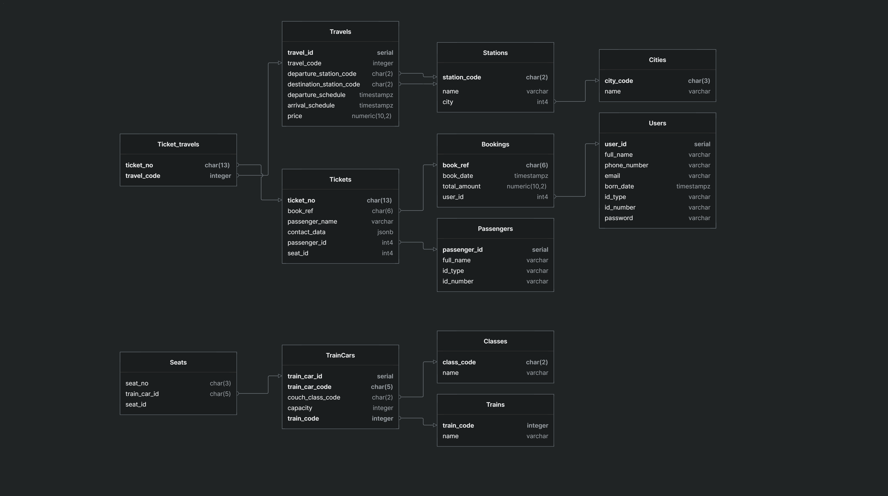
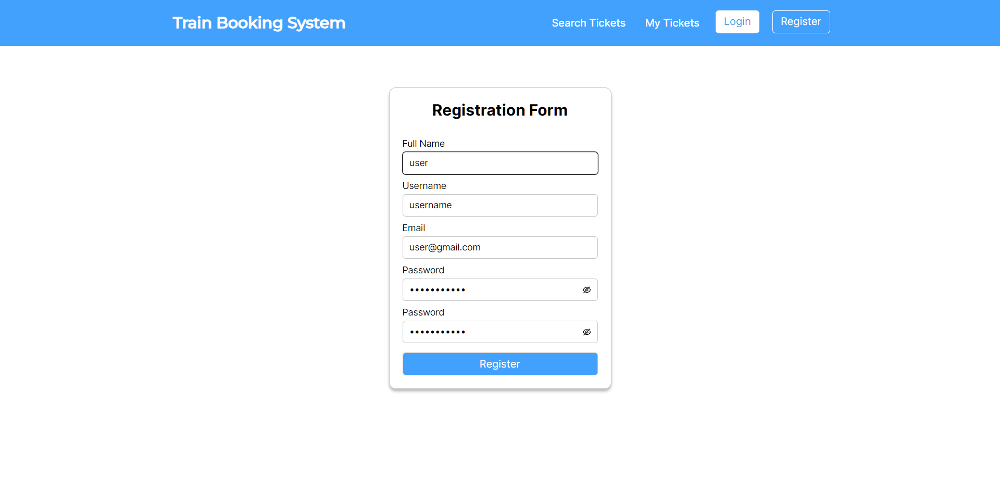
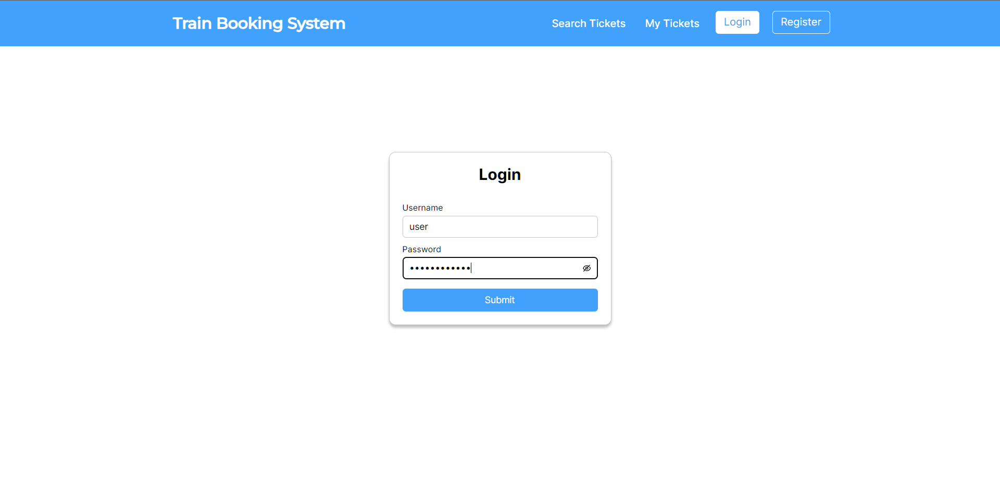
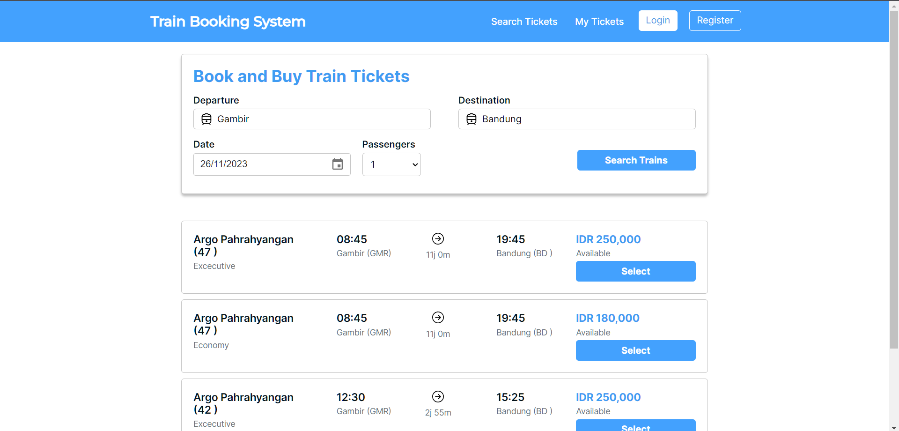
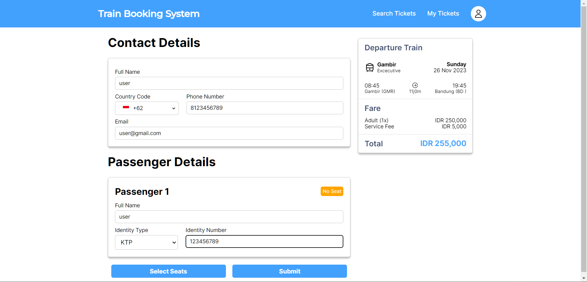
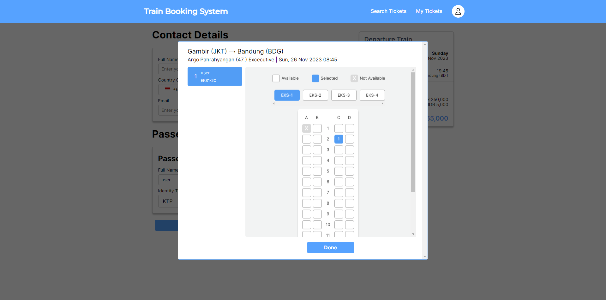
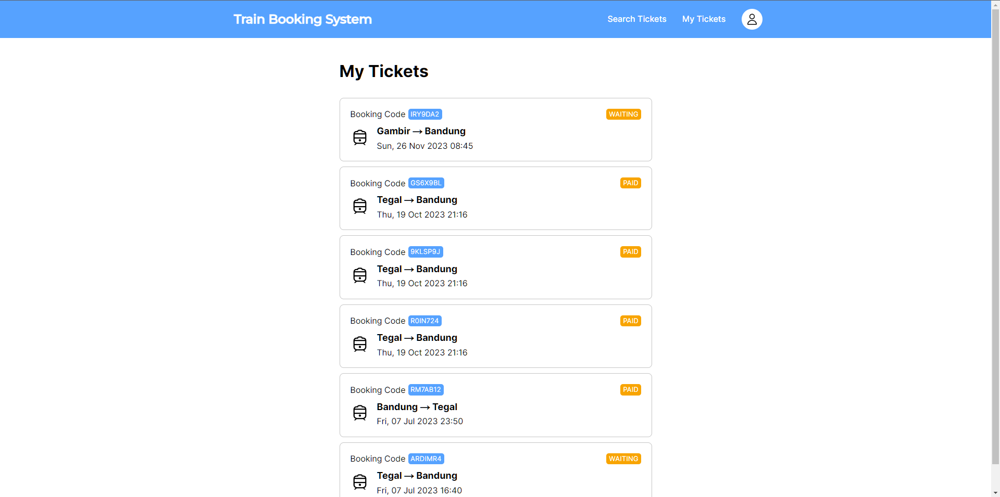
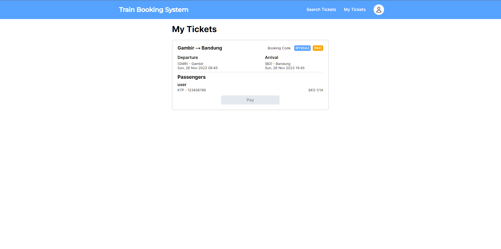

<!-- PROJECT LOGO -->
<br />
<div align="center">
  <!-- <a href="https://github.com/othneildrew/Best-README-Template">
    
  </a> -->

  <h3 align="center">Train Booking System</h3>

  <p align="center">
    A simple system for online book and buy train tickets. Inspired by KAI's booking system (Indonesian Railways Company).
    <br />
    <!-- <a href="https://github.com/othneildrew/Best-README-Template"><strong>Explore the docs »</strong></a> -->
    <br />
    <br />
    <!-- <a href="https://github.com/othneildrew/Best-README-Template">View Demo</a> -->
    <!-- · -->
    <!-- <a href="https://github.com/othneildrew/Best-README-Template/issues">Report Bug</a> -->
    <!-- · -->
    <!-- <a href="https://github.com/othneildrew/Best-README-Template/issues">Request Feature</a> -->
  </p>
</div>


<!-- TABLE OF CONTENTS -->
<details>
  <summary>Table of Contents</summary>
  <ol>
    <li>
      <a href="#about-the-project">About The Project</a>
      <ul>
        <li><a href="#built-with">Built With</a></li>
      </ul>
    </li>
    <li>
      <a href="#getting-started">Getting Started</a>
      <ul>
        <li><a href="#prerequisites">Prerequisites</a></li>
        <li><a href="#installation">Installation</a></li>
      </ul>
    </li>
    <li><a href="#usage">Usage</a></li>
    <li><a href="#roadmap">Roadmap</a></li>
    <li><a href="#contributing">Contributing</a></li>
    <li><a href="#license">License</a></li>
    <li><a href="#contact">Contact</a></li>
    <li><a href="#acknowledgments">Acknowledgments</a></li>
  </ol>
</details>


<!-- ABOUT THE PROJECT -->
## About The Project

<!-- [![Product Name Screen Shot][product-screenshot]](https://example.com) -->

The Train Booking System is application designed to streamline the process of booking train tickets.

Key Features:
  * Search and Book Trains:
    - Passengers can search for available trains by entering their departure and arrival destinations, travel dates, and class preferences.
    - A comprehensive list of train options, along with details such as departure and arrival times, ticket prices, and available seats, is displayed for easy selection
  * Seat Selection:
    - Passengers can choose their preferred seats or berths, helping them plan their journey with comfort and convenience in mind.
  * Ticket Management:
    - Passengers can view and manage their booked tickets, including the ability to cancel or reschedule their journeys (subject to the railway's policies).
  * User Profiles:
    - Passengers can create and manage user profiles with personal information, enabling faster and easier booking for future trips.


<p align="right">(<a href="#readme-top">back to top</a>)</p>


### Built With

* [![Golang][Golang]][Golang-url]
* [![Postgres][Postgres]][Postgres-url]
* [![Redis][Redis]][Redis-url]


<p align="right">(<a href="#readme-top">back to top</a>)</p>

### Database Design



<details>
  <summary>Trains</summary>

  | Code | Name |
  | --- | --- |
  | CHE | Argo Cheribon |
  | PHR | Argo Pahrahyangan |
  | TKS | Taksaka |
  | DWP | Argo Dwipangga |
  | SMU | Argo Semeru |
  | GJY | Gajayana |
  | KLG | Kaligung |
  | CIR | Ciremai |
  | HAR | Harina |
  
</details>

<details>
  <summary> Available Travels </summary>

  | Travel Code | Departure Station | Destination Station | Train Name | Departure Schedule | Arrival Schedule | EKO Fare | EKS Fare |
  | --- | --- | --- | --- | --- | --- | --- | --- |
  | 26 | Gambir | Tegal | Argo Cheribon | 08:30 | 12:39 | 180000 | 220000 |
  | 27 | Tegal | Gambir | Argo Cheribon | 13:30 | 17:34 | 180000 | 220000 |
  | 42 | Gambir | Bandung | Argo Pahrahyangan | 12:30 | 15:25 | 150000 | 200000 |
  | 47 | Bandung | Gambir | Argo Pahrahyangan | 08:45 | 11:52 | 150000 | 200000 |
  | 68 | Gambir | Yogyakarta | Taksaka | 09:20 | 15:40 |  | 500000 |
  | 67 | Yogyakarta | Gambir | Taksaka | 08:45 | 15:09 |  | 500000 |
  | 10 | Gambir | Solo Balapan | Argo Dwipangga | 08:50 | 15:50 |  | 350000 |
  | 9 | Solo Balapan | Gambir | Argo Dwipangga | 20:30 | 03:30 |  | 350000 |
  | 18 | Gambir | Gubeng | Argo Semeru | 06:20 | 16:50 |  | 450000 |
  | 17 | Gubeng | Gambir | Argo Semeru | 09:05 | 19:40 |  | 450000 |
  | 56 | Gambir | Malang | Gajayana | 18:50 | 07:06 |  | 550000 |
  | 55 | Malang | Gambir | Gajayana | 14:55 | 03:10 |  | 550000 |
  | 194 | Tegal | Semarang Poncol | Kaligung | 05:05 | 07:18 | 80000 | 120000 |
  | 195 | Semarang Poncol | Tegal | Kaligung | 05:00 | 07:14 | 80000 | 120000 |
  | 196 | Tegal | Semarang Poncol | Kaligung | 10:46 | 12:55 | 80000 | 120000 |
  | 197 | Semarang Poncol | Tegal | Kaligung | 13:50 | 16:04 | 80000 | 120000 |
  | 192 | Tegal | Semarang Poncol | Kaligung | 12:32 | 14:45 | 85000 | 1150000 |
  | 193 | Semarang Poncol | Tegal | Kaligung | 17:00 | 19:15 | 85000 | 115000 |

</details>

<!-- GETTING STARTED -->
## Getting Started
<details>
  <summary>Local Development</summary>

  ### Prerequisites
  * Golang
  * Make
  * Redis
  * PostgreSQL
    <!-- ```sh
    npm install npm@latest -g
    ``` -->

  ### Installation

  1. Clone the repo
      ```sh
      git clone https://github.com/ardimr/train-booking-system
      ```
  2. Install Go packages
      ```sh
      go mod install
      ```
  3. Run the program
      ```sh
      make run_app
      ``` 
</details>

<details>
  <summary>Run With Docker Compose</summary>
  
  ### How To Run with Docker
  
  *Make sure you have installed the docker-compose. Please follow this link for the [guidance](https://docs.docker.com/compose/install/)
  1. Clone the repo
      ```sh
      git clone https://github.com/ardimr/train-booking-system
      ```
     or you can simply just copy the docker-compose file in this repository

  2. Run docker-compose

      - Start Application
        ```sh
        docker-compose up -d
        ```

      - Stop Application
        ```sh
        docker-compose down
        ```
</details>


<p align="right">(<a href="#readme-top">back to top</a>)</p>


<!-- USAGE EXAMPLES -->
## Usage
<details>
  <summary>Sample Screens</summary>

  - Registration
    
  - Login
    
  - Search Tickets
    
  - Booking Page
    
  - Seats Selection
    
  - My Tickets
    
    
</details>

_For more examples, please refer to the [Documentation](api/openapi:%20'3.0.yml)_

<p align="right">(<a href="#readme-top">back to top</a>)</p>


<!-- ROADMAP -->
## Roadmap

- [x] Add authentication and authorization
- [ ] Payment integration
- [x] Database Migration
- [ ] Refactor booking mechanism
- [ ] Add Notification
- [ ] Load Testing
- [ ] UI Flow
- [ ] Admin Dashboard
- [ ] UI Booking Form Validation

See the [open issues](https://github.com/othneildrew/Best-README-Template/issues) for a full list of proposed features (and known issues).

<p align="right">(<a href="#readme-top">back to top</a>)</p>


<!-- CONTRIBUTING -->
<!-- ## Contributing

Contributions are what make the open source community such an amazing place to learn, inspire, and create. Any contributions you make are **greatly appreciated**.

If you have a suggestion that would make this better, please fork the repo and create a pull request. You can also simply open an issue with the tag "enhancement".
Don't forget to give the project a star! Thanks again!

1. Fork the Project
2. Create your Feature Branch (`git checkout -b feature/AmazingFeature`)
3. Commit your Changes (`git commit -m 'Add some AmazingFeature'`)
4. Push to the Branch (`git push origin feature/AmazingFeature`)
5. Open a Pull Request

<p align="right">(<a href="#readme-top">back to top</a>)</p> -->


<!-- LICENSE -->
## License

Distributed under the MIT License. See `LICENSE.txt` for more information.

<p align="right">(<a href="#readme-top">back to top</a>)</p>


<!-- CONTACT -->
## Contact

Rizky Ardi Maulana - rizkyardimaulana@gmail.com

Project Link: 
* Backend: [https://github.com/ardimr/train-booking-system](https://github.com/ardimr/train-booking-system)
* Frontend: [https://github.com/ardimr/train-booking-system.frontend](https://github.com/ardimr/train-booking-system.frontend)

<p align="right">(<a href="#readme-top">back to top</a>)</p>


<!-- ACKNOWLEDGMENTS -->
<!-- ## Acknowledgments

Use this space to list resources you find helpful and would like to give credit to. I've included a few of my favorites to kick things off!

* [Choose an Open Source License](https://choosealicense.com)
* [GitHub Emoji Cheat Sheet](https://www.webpagefx.com/tools/emoji-cheat-sheet)
* [Malven's Flexbox Cheatsheet](https://flexbox.malven.co/)
* [Malven's Grid Cheatsheet](https://grid.malven.co/)
* [Img Shields](https://shields.io)
* [GitHub Pages](https://pages.github.com)
* [Font Awesome](https://fontawesome.com)
* [React Icons](https://react-icons.github.io/react-icons/search)

<p align="right">(<a href="#readme-top">back to top</a>)</p> -->


<!-- MARKDOWN LINKS & IMAGES -->
<!-- https://www.markdownguide.org/basic-syntax/#reference-style-links -->
[contributors-shield]: https://img.shields.io/github/contributors/othneildrew/Best-README-Template.svg?style=for-the-badge
[contributors-url]: https://github.com/othneildrew/Best-README-Template/graphs/contributors
[forks-shield]: https://img.shields.io/github/forks/othneildrew/Best-README-Template.svg?style=for-the-badge
[forks-url]: https://github.com/othneildrew/Best-README-Template/network/members
[stars-shield]: https://img.shields.io/github/stars/othneildrew/Best-README-Template.svg?style=for-the-badge
[stars-url]: https://github.com/othneildrew/Best-README-Template/stargazers
[issues-shield]: https://img.shields.io/github/issues/othneildrew/Best-README-Template.svg?style=for-the-badge
[issues-url]: https://github.com/othneildrew/Best-README-Template/issues
[license-shield]: https://img.shields.io/github/license/othneildrew/Best-README-Template.svg?style=for-the-badge
[license-url]: https://github.com/othneildrew/Best-README-Template/blob/master/LICENSE.txt
[linkedin-shield]: https://img.shields.io/badge/-LinkedIn-black.svg?style=for-the-badge&logo=linkedin&colorB=555
[linkedin-url]: https://linkedin.com/in/othneildrew
[product-screenshot]: images/screenshot.png
[Next.js]: https://img.shields.io/badge/next.js-000000?style=for-the-badge&logo=nextdotjs&logoColor=white
[Next-url]: https://nextjs.org/
[React.js]: https://img.shields.io/badge/React-20232A?style=for-the-badge&logo=react&logoColor=61DAFB
[React-url]: https://reactjs.org/
[Vue.js]: https://img.shields.io/badge/Vue.js-35495E?style=for-the-badge&logo=vuedotjs&logoColor=4FC08D
[Vue-url]: https://vuejs.org/
[Angular.io]: https://img.shields.io/badge/Angular-DD0031?style=for-the-badge&logo=angular&logoColor=white
[Angular-url]: https://angular.io/
[Svelte.dev]: https://img.shields.io/badge/Svelte-4A4A55?style=for-the-badge&logo=svelte&logoColor=FF3E00
[Svelte-url]: https://svelte.dev/
[Laravel.com]: https://img.shields.io/badge/Laravel-FF2D20?style=for-the-badge&logo=laravel&logoColor=white
[Laravel-url]: https://laravel.com
[Bootstrap.com]: https://img.shields.io/badge/Bootstrap-563D7C?style=for-the-badge&logo=bootstrap&logoColor=white
[Bootstrap-url]: https://getbootstrap.com
[JQuery.com]: https://img.shields.io/badge/jQuery-0769AD?style=for-the-badge&logo=jquery&logoColor=white
[JQuery-url]: https://jquery.com 
[Golang]: https://img.shields.io/badge/go-%2300ADD8.svg?style=for-the-badge&logo=go&logoColor=white
[Golang-url]: https://go.dev/
[Redis]: https://img.shields.io/badge/redis-%23DD0031.svg?style=for-the-badge&logo=redis&logoColor=white
[Redis-url]: https://redis.io/
[Postgres]: https://img.shields.io/badge/postgres-%23316192.svg?style=for-the-badge&logo=postgresql&logoColor=white
[Postgres-url]: https://www.postgresql.org/